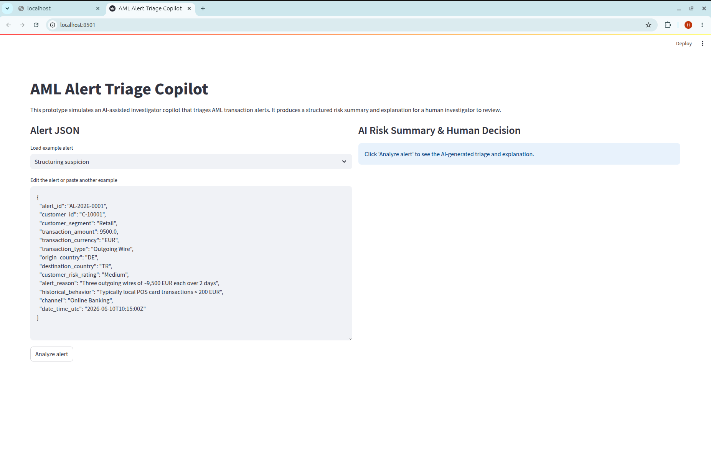
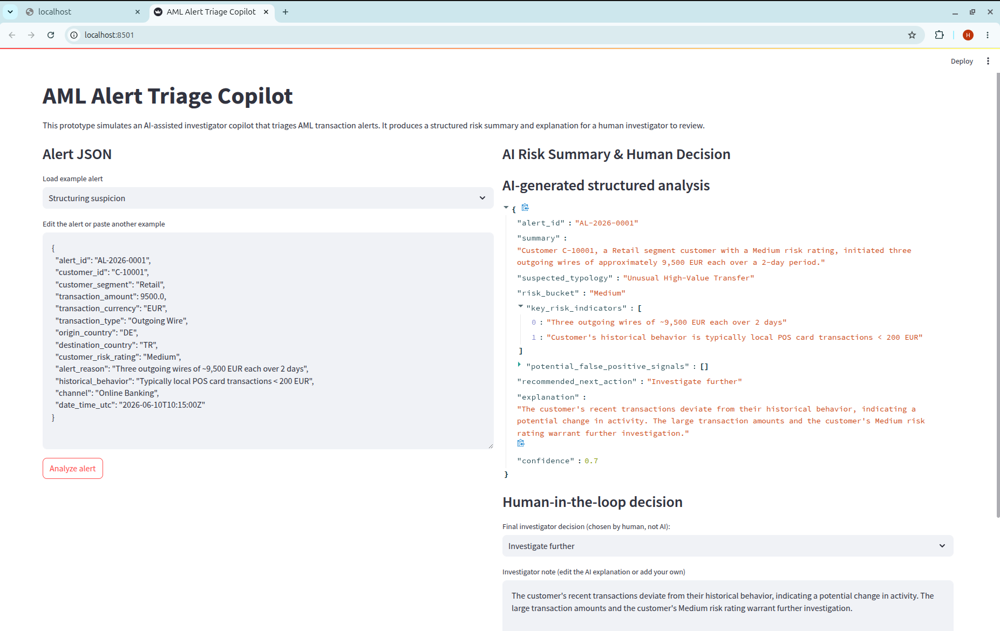

# AML Alert Triage Copilot

<p align="center">
  
</p>

<p align="center">
  
</p>


This project is a small but realistic prototype of an **AI-assisted AML investigator copilot**.  
It takes transaction monitoring alerts as JSON, generates a structured risk summary (typology, risk bucket, indicators, explanation), and leaves the **final decision explicitly to a human investigator**.

The goal is to demonstrate:
- AI workflow design (LLM + rule overlay + human-in-the-loop).
- Structured outputs instead of a generic chatbot.
- Clear boundaries between AI suggestions and compliance decisions.
- A demo-friendly UI suitable for a 10-minute live walkthrough.

> **Important:** This project uses synthetic data only and is for demonstration/portfolio purposes.  
> It is not a production system and is not a substitute for regulatory model validation or full AML programs.

---

## Architecture

- **Backend:** FastAPI (Python)  
  - Pydantic models for `AlertInput` and `AlertAnalysisOutput`.  
  - `analyze` endpoint calls an LLM to generate a structured summary and applies a small rule overlay (e.g. enforcing minimum risk for high-risk customers).

- **LLM layer:** Groq Cloud (OpenAI-compatible API) + Llama 3  
  - Uses an OpenAI-compatible client pointed at Groq's base URL.  
  - Prompt is tuned for:
    - AML typologies (structuring/smurfing, layering, mule accounts, sanctions risk, terrorist financing, fraud patterns, unusual behavior change).  
    - Explainability: explanations must reference concrete alert fields.  
    - Boundaries: never file SARs or make final “no-risk” statements.

- **Frontend:** Streamlit  
  - Left: editable JSON for the alert (with a couple of pre-defined examples).  
  - Right: AI-generated structured analysis + a "Human-in-the-loop" section where the investigator chooses the final decision and edits the note.

---

## Getting started

### 1. Clone the repository

```bash
git clone https://github.com/ali76-AFK/AML-Alert-Triage-Copilot.git
cd AML-Alert-Triage-Copilot
```

### 2. Create and activate a virtual environment (Python 3.10+)

```bash
python3 -m venv .venv
source .venv/bin/activate
```

### 3. Install dependencies

```bash
python -m pip install --upgrade pip
python -m pip install fastapi uvicorn[standard] pydantic streamlit openai python-dotenv httpx
```

### 4. Configure Groq API (LLM backend)

Create a `.env` file in the project root:

```text
GROQ_API_KEY=gsk_YOUR_REAL_KEY_HERE
GROQ_MODEL=llama-3.1-8b-instant
GROQ_BASE_URL=https://api.groq.com/openai/v1
```

> `.env` is in `.gitignore` and should **never** be committed.

### 5. Run backend (FastAPI)

```bash
uvicorn app.main:app --reload
```

Test quickly:

```bash
python scripts/test_request.py   # optional helper script or use curl
```

### 6. Run frontend (Streamlit UI)

In another terminal:

```bash
source .venv/bin/activate
streamlit run ui/app.py
```

Open the URL printed by Streamlit (usually `http://localhost:8501`).

---

## How the workflow behaves

1. **Input:** An `AlertInput` JSON describing a transaction monitoring alert  
   (amount, countries, customer risk, alert reason, historical behavior, etc.).

2. **LLM analysis:**
   - Maps the alert into a strict `AlertAnalysisOutput` schema:
     - `summary`
     - `suspected_typology`
     - `risk_bucket`
     - `key_risk_indicators`
     - `potential_false_positive_signals`
     - `recommended_next_action`
     - `explanation`
     - `confidence`
   - Follows AML typology guidelines (e.g., structuring/smurfing when there are multiple just-below-threshold transactions; layering when flows are complex and obscuring origin).[1][2]

3. **Rule overlay:**
   - Simple Python rules adjust the AI output (e.g., never keep risk as "Low" for inherently high-risk customers, or very large transactions).
   - Explanation is annotated so it is clear what came from the model vs. deterministic rules.

4. **Human-in-the-loop decision:**
   - The UI shows AI output, but the dropdown for the final decision is always controlled by the human.
   - The investigator note can be edited and represents what would be stored in a real case management system.

---

## Demo notes (for interviews)

For a 10-minute live demo, you can:

- Start with the “Structuring suspicion” example (three transfers just below reporting threshold).  
- Show how the copilot:
  - Identifies an appropriate typology (e.g., “Structuring / Smurfing” or “Unusual High-Value Transfer”).  
  - Explains the risk in terms of amounts, frequency, and deviation from historical behavior.  
  - Suggests “Investigate further” or “Escalate”, but does **not** make a final regulatory decision.

- Then switch to the “Likely false positive” example (slightly higher salary for a low-risk retail customer).  
- Highlight the difference in risk indicators and potential false positive signals, and how the human may choose to close it as a likely false positive.

---

## Limitations and next steps

- Synthetic alerts only; no real customer data.  
- No persistence layer yet (decisions are not stored in a real database).  
- Typology and rule sets are deliberately small for clarity.

Possible extensions:

- Add a small SQLite database for logging AI suggestions vs. human decisions.  
- Support more alert types and richer typology lists.  
- Integrate with real AML systems, ticketing tools, or case management APIs (where allowed).

---

[1] Common AML typologies (structuring, layering, mule accounts, sanctions) as described in public typology reports and AML guidance.  
[2] Explainable AI and model validation practices from public AML/financial crime literature.
